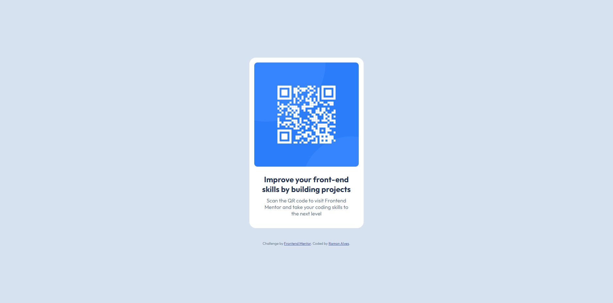
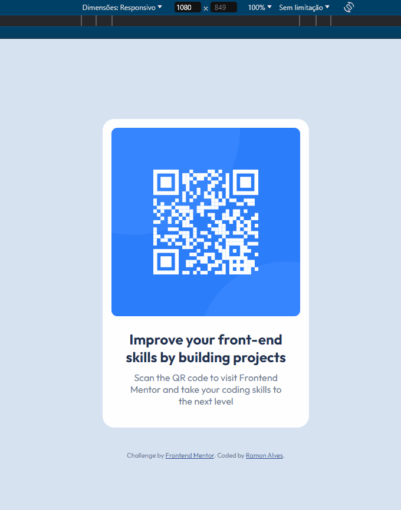

# Frontend Mentor - QR code component solution

This is a solution to the [QR code component challenge on Frontend Mentor](https://www.frontendmentor.io/challenges/qr-code-component-iux_sIO_H). Frontend Mentor challenges help you improve your coding skills by building realistic projects. 

## Overview

This is a simple page containing a card with a qr code and a description.

***Time spent: 1 hour***

## Screenshot

  ### Desktop

  

  ### Mobile

  

  ### Responsivity

  

## Links

- Solution URL: [Frontend Mentor](https://www.frontendmentor.io/solutions/-html5-e-css-6-newbie-qr-code-component-v1CkvK8VhJ)
- Live Site URL: [Site Preview](https://ramon-alvez.github.io/qr-code-component-main/)

## My process

### Built with

- Semantic HTML5 markup
- CSS custom properties
- Flexbox

## What I learned

Nothing in particular.

## Continued development

I intend to continue doing the frontend mentor challenges until I finish them all.

## Author

- GitHub - [Ramon Alvez](https://github.com/Ramon-Alvez)
- Frontend Mentor - [@Ramon Alvez](https://www.frontendmentor.io/profile/Ramon-Alvez)
- LinkedIn - [@Ramon Alvez](https://www.linkedin.com/in/ramon-alvez/)
